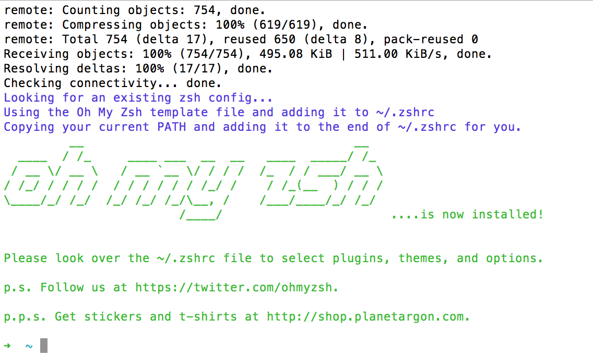
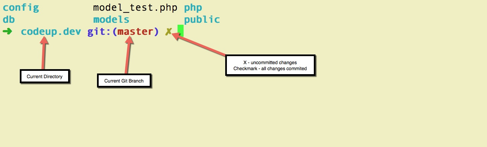
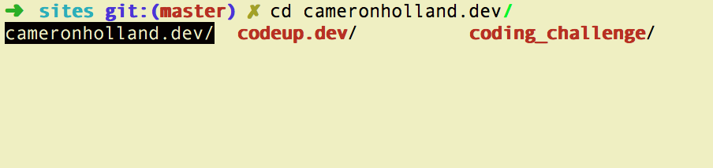

# Setup Oh My Zsh

This is a walk through guide of how to setup Oh My Zsh in your terminal. You can learn more about [Oh My Zsh](http://ohmyz.sh/) and [Zsh](http://www.zsh.org/) on their websites.

## Installing Zsh

First you need to install Zsh before we can use Oh My Zsh. To do this, you will need to clone zsh from github. First cd into your home directory, `cd ~`, and then run the command below:

~~~
git clone git://zsh.git.sf.net/gitroot/zsh/zsh
~~~

Once the download has finished run the command `zsh --version` to make sure it was downloaded correctly. You should see `zsh 5.0.8` if not then you will need to retry installing zsh. Some of your computers could have come with zsh already installed on it. In that case as long as you have version 4.3.9 or newer, Oh My Zsh won't have an issue.

Next you need to setup zsh as your default shell. Try the command `chsh -s $(which zsh)`. Now open a new terminal window and run the command `echo $SHELL`. If you see anything besides `/bin/zsh` the chsh command did not work and we will need to try to [change the default another way](https://www.google.com/search?q=zsh+default+without+chsh). As long as the install script(step below) for Oh My Zsh does not break, the default shell should be changed on its own. My personal preference is to make sure I do it before hand.

You should notice some small changes to your terminal and how it looks. Also on the top of your terminal window it should say zsh with some other information.

## Installing Oh My Zsh

Now that we have zsh installed and setup as your default shell, we can install Oh My Zsh. Once this is installed, your terminal will look a lot different. We'll talk about what all you can do once we get there.

In your new terminal window, enter the command below:

~~~
sh -c "$(curl -fsSL https://raw.github.com/robbyrussell/oh-my-zsh/master/tools/install.sh)"
~~~

Once the download is finished, it should install and you should get a message saying Oh My Zsh is installed. You terminal prompt should look like this:

## Breakdown of Oh My Zsh

Now that Oh My Zsh is installed, your terminal should look something like this:

Now lets talk about what you can do with Oh My Zsh.

When you attempt to cd into a directory you can hit tab and it will auto complete like normal. If you have not typed enough of the directory name for it to know which folder you are referring to, it will show you a list of possibilities like the below image:

You can use this to remember what directory you want or you can hit tab again and it will let you use the arrows(or tab through) the possibilities and hit enter:

Once you hit enter it will add the correct directory name to your command without running the command so you can add more or run the command.

For more information you can use the [Oh My Zsh Cheatsheet](https://github.com/robbyrussell/oh-my-zsh/wiki/Cheatsheet).

I have also included my [.zshrc](.zshrc)(zsh equivalent of .bash_profile) file so you can add some customization. If you do not have a .zshrc file in your home(~) directory you can create one. It should already be created by default after installing Oh My Zsh.

## Contact Me

If you have any questions, have some suggestions, or feel like some of the instructions are unclear you can email me at cameron@thenearsky.com. Also you can check out my personal site [cameronholland.me](http://cameronholland.me/) or follow me on twitter [xCAMER0Nx](https://twitter.com/xCAMER0Nx).